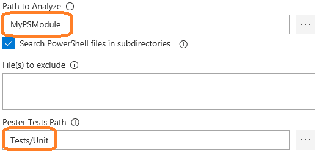
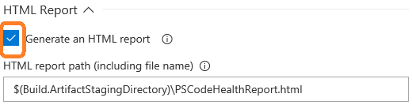
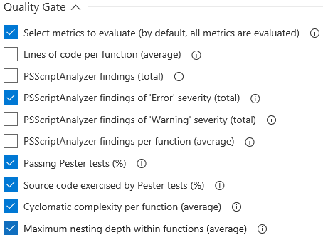
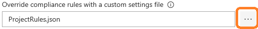
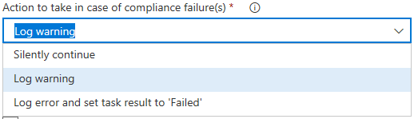

## What is PSCodeHealth  

**PSCodeHealth** is a PowerShell module which helps assessing the quality of your PowerShell code, based on a variety of metrics related to :  
  - Code length  
  - Code complexity  
  - Code smells, styling issues and violations of best practices  
  - Tests and test coverage  
  - Comment-based help  

It allows to define quality gates for your PowerShell code, based on these metrics.  
You can override some (or all) of the default compliance rules to fit your quality goals.  

## About the PSCodeHealth VSTS extension  

This VSTS extension provides a Build/Release task to gather **PowerShell** code quality metrics.  
This task also allows to define (and optionally enforce) quality gates based on these code metrics.  
It is essentially a wrapper around the **[PSCodeHealth](https://github.com/MathieuBuisson/PSCodeHealth)** PowerShell module to make it easy to use within VSTS.  

### Features  

  - Analyse code in PowerShell files (.ps1, .psm1 and .psd1) or a directory  
  - Run [Pester](https://github.com/pester/Pester) tests and summarize results and code coverage  
  - Generate an HTML report (here is [a live example](https://mathieubuisson.github.io/assets/html/healthreport.html))  
  - Select specific code metrics to evaluate for compliance  
  - Override some (or all) compliance rules with user-defined rules  
  - Enforce the quality gate, i.e.: fail the build in case of compliance failure(s)  

## Using the PSCodeHealth extension  

### Requirements  

This extension can be used in :  
  - Any VSTS account  
  - TFS 2017 Update 2 (and above) with agent version 2.131.x (and above)  

<strong>NOTE :</strong> This extension has not been thoroughly tested with TFS, so your on-premises mileage may vary. If you encounter any issue, <a href="https://github.com/MathieuBuisson/vsts-PSCodeHealth/issues/new?template=bug_report.md">bug reports</a> are welcome.

### Installation  

  * Browse to the [Visual Studio Team Services marketplace](https://marketplace.visualstudio.com/vsts)  
  * In the search box, type : `pscodehealth`  
  * There should be only 1 result, click on it  
  * Click on the "**Get it free**" button  
  * Select your VSTS account and click "**Install**"  
  * After a few seconds, you should see a message telling that you are all set and a link to your VSTS account  

Once installed, the **PSCodeHealth** task will be available for :  
  - Build definitions  
  - Release definitions  

### Using the task in a build (or release) definition  

#### Specifying the paths of PowerShell code and tests  

  

  * The field labeled "**Path to Analyze**" allows to specify the location of the PowerShell files to analyze (click the ellipsis button to look for the file or folder in your repository).  

  * If "**Path to Analyze**" is a folder, the checkbox "**Search PowerShell files in subdirectories**" allows to analyze PowerShell code in subfolders.  

  * The field labeled "**Pester Tests Path**" allows to specify the location of the tests (click the ellipsis button to look for the file or folder in your repository).  

#### Generating an HTML report  

You may opt to generate an HTML report by checking the following checkbox :  

  

This will enable the field labeled "**HTML report path**" to specify the path and file name of the report.  

#### Selecting specific code metrics  

The quality gate compares actual code metrics of the analyzed PowerShell code with compliance rules for these metrics.  
If 1 or more evaluated code metric(s) doesn't meet its compliance rule, the analyzed code doesn't meet the quality gate.  

By default, the task will evaluate **all** code metrics against their respective compliance rules.  
If you only care about specific metrics, you can specify which ones by checking the box labeled "**Select metrics to evaluate**".  

This will enable additional checkboxes to choose which metrics to evaluate for compliance.  

  

For details on the code metrics collected by **PSCodeHealth**, please refer to [this documentation page](http://pscodehealth.readthedocs.io/en/latest/Metrics/#metrics-collected-for-the-overall-health-report).  

#### Overriding the default compliance rules  

**PSCodeHealth** comes with default compliance rules which determine, for their respective code metric, whether the analyzed code passes or fails.  

These default rules can be overridden for some (or all) of the code metrics, so you can define the quality gate to suit your requirements or goals.  

The field labeled "**Override compliance rules with a custom settings file**" allows to specify the JSON file where custom compliance rules are defined.  
(click the ellipsis button to look for the file in your repository).  

  

For details on compliance rules and how to customize them, please refer to [this documentation page](http://pscodehealth.readthedocs.io/en/latest/HowDoI/CustomizeComplianceRules/).  

#### Enforcing the quality gate  

You can choose how to enforce your quality gate with the field "**Action to take in case of compliance failure(s)**" :  

  

**Possible values and their effect** :  
  - **Silently continue** : no action is taken  
  - **Log warning** : a warning is logged for each failing metric  
  - **Log error and set task result to 'Failed'** :  
    - a warning is logged for each failing metric  
    - an error is logged with the names of metrics failing compliance  
    - the task result is set to 'Failed', which also sets the overall build result to 'Failed'  
